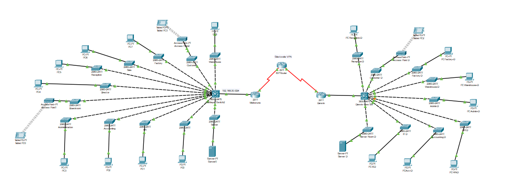

## 📌 Overview
This project demonstrates a small enterprise network with:
- Router-on-a-stick inter-VLAN routing
- VLAN segmentation for departments (Reception, Sales, Factory, Customers)
- DHCP and static IP assignments
- Access Point with wireless connectivity
- Trunk and access port configurations

---

## 🖧 Router Configuration
- **Router Model:** Cisco 2911
- **Interfaces:**
  - `G0/0.10` → VLAN 10 (Reception) → 192.168.10.1/24
  - `G0/0.20` → VLAN 20 (Sales) → 192.168.20.1/24
  - `G0/0.30` → VLAN 30 (Factory) → 192.168.30.1/24
  - `G0/0.40` → VLAN 40 (Customers) → 192.168.40.1/24
- **Default Gateway:** `ip route 0.0.0.0 0.0.0.0 192.168.100.3`
- **Notes:** IPsec VPN crypto map configured but needs ISAKMP policy for full functionality.

---

## 🔀 Switch Configuration
- **Switch Model:** Cisco 2960
- **VLANs:**
  - VLAN 10 → Reception
  - VLAN 20 → Sales
  - VLAN 30 → Factory
  - VLAN 40 → Customers
- **Ports:**
  - Access ports assigned per department
  - Trunk port enabled on `Fa0/1` (connected to Router)
- **Spanning-Tree:** Default mode

---

## 📡 Access Point Configuration
- **Model:** Cisco WRT300N (Packet Tracer Wireless Router/Access Point)
- **IP Address:** `192.168.40.2`
- **SSID:** `CompanyWiFi`
- **Security:** WPA2-PSK (Password: `12345678`)
- **DHCP:** Enabled for wireless clients (Range: 192.168.40.100 – 192.168.40.150)
- **Default Gateway:** `192.168.40.1`

✅ Wireless clients successfully receive IP via DHCP and can ping other VLANs through the Router.

---

## 🛠 Testing & Verification
1. **Ping Test:**
   - From Reception PC → Sales PC → Factory PC → Customer Laptop
   - Wireless laptop connected via AP can reach wired VLANs.
2. **VLAN Isolation:**
   - Devices in different VLANs require router inter-VLAN routing.
3. **Wireless Connectivity:**
   - Connect to `CompanyWiFi` SSID with WPA2 password `12345678`.
   - Confirm IP lease in `192.168.40.x` range.
4. **Internet Simulation (Optional):**
   - Router’s default route (`192.168.100.3`) can be connected to ISP cloud for external connectivity.

---
## 🖼 Network Topology

---
